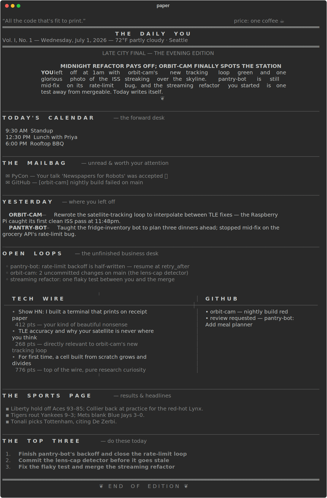
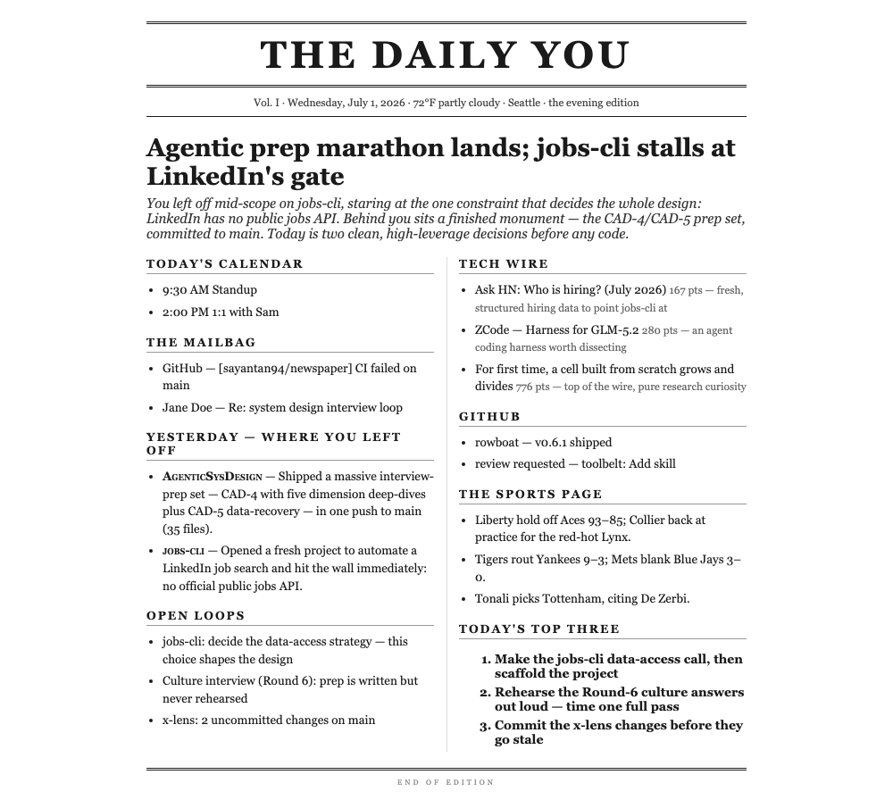

<h1 align="center">🗞️ paper</h1>
<p align="center"><b>Wake up. Pour coffee. Read yesterday's you.</b></p>

`paper` is a personal newspaper for your terminal. It reads what you actually
did — your Claude Code sessions, Codex sessions, and git commits — and an AI
editorial desk writes you a front page: where you left off, what's unfinished,
your inbox and calendar, the news that matters to your work, and the three
things worth doing today.

No manual journaling. No "what was I doing again?" Just run `paper`.

<p align="center"></p>

## What's in your paper

| Section | Where it comes from |
|---|---|
| **Headline & lead** | Written fresh by the editorial desk, grounded in your real work |
| **Today's calendar** | Your Google Calendar (secret iCal URL — zero OAuth) |
| **The mailbag** | Your unread Gmail (IMAP app password, kept in the Keychain) |
| **Yesterday** | Your Claude Code + Codex sessions and git commits, auto-journaled |
| **Open loops** | Dirty repos, unpushed commits, threads you left hanging |
| **Tech wire** | Hacker News + your RSS feeds, annotated with *why it matters to you* |
| **GitHub** | Notifications and PRs awaiting your review (`gh`) |
| **The sports page** | ESPN headlines + scores for your leagues (or `"all"`) |
| **The top three** | Concrete suggestions for today, from your open loops |

The paper knows when you're reading: the same command prints **THE MORNING
EDITION** at 8am and **THE LATE NIGHT EDITION** at 1am, written for that moment.

## Quickstart

Requires Python ≥ 3.11, [uv](https://docs.astral.sh/uv/), and the
[Claude Code](https://claude.com/claude-code) or
[Codex](https://github.com/openai/codex) CLI (driven headlessly — **no API keys**).

```bash
git clone https://github.com/sayantan94/newspaper && cd newspaper
uv tool install --editable .
paper              # names your paper, then backfills your journal (one-time, narrated)
paper auth gmail   # optional: connect Gmail + Google Calendar
```

First run takes a couple of minutes to journal your recent history. Every run
after that is seconds — editions are cached for the day.

## Commands

| Command | What it does |
|---|---|
| `paper` | Today's edition (journals anything unprocessed first) |
| `paper --refresh` | Refetch the world + rewrite the editorial |
| `paper pdf` | **Print edition** — newspaper-styled PDF via headless Chrome |
| `paper journal [date]` | Read your auto-built journal |
| `paper 2026-06-30` | Re-read a past edition |
| `paper ingest` | Update the journal only (cron-friendly) |
| `paper auth gmail` | Connect Gmail + Calendar (Keychain, no OAuth consoles) |
| `paper connectors` | Every connector and its status |
| `paper config` | Show configuration |

## The print edition

`paper pdf` typesets the day's edition for actual paper:

<p align="center"></p>

## Configuration

`~/.paper/config.toml`, created on first run — see
[config.example.toml](config.example.toml) for every option with comments:

```toml
masthead = "THE DAILY YOU"                    # your paper's name
workspace_roots = ["~/Documents/Workspace"]   # where your repos live

[technews]
rss_feeds = []                                # your feeds join the tech wire

[sports]
leagues = ["all"]                             # or: nba, wnba, nfl, mlb, nhl, epl, ucl, mls

[llm]
engine = "claude"                             # or "codex" — whichever CLI you use
```

All state lives in `~/.paper/` (journal, editions, cache). Override with `$PAPER_HOME`.

<details>
<summary><b>Connecting Google (Gmail + Calendar) — step by step</b></summary>

<br>One command, no Google Cloud project, no OAuth consent screens:

```bash
paper auth gmail
```

It asks for two things and stores both in your macOS Keychain.

**0. Be in the right Google account** — the pages below act on whichever
account is active; check the avatar top-right.

**1. Turn on 2-Step Verification** (app passwords require it):
<https://myaccount.google.com/signinoptions/twosv>

**2. Create the app password:** go to
<https://myaccount.google.com/apppasswords>, type `paper` as the app name,
click **Create**, and copy the **16-character code** — it's shown only once.
This is *not* your normal Gmail password.

**3. Get the calendar URL:** <https://calendar.google.com> → gear → **Settings**
→ your calendar in the left sidebar → **Integrate calendar** →
**"Secret address in iCal format"**.

**4. Run `paper auth gmail`** and paste both when prompted (spaces in the code
are fine). It test-drives each before saving — a ✓ means it works.

*Gotchas:* "Invalid credentials" = normal password used instead of an app
password, or the app password was created under a different Google account
than the address you typed. App passwords never appear under "linked apps" —
that page only lists OAuth apps.

</details>

## Write your own connector

Every source is a plugin. Drop a file in `~/.paper/connectors/` — no core
changes, and a broken plugin can never take down the paper:

```python
# ~/.paper/connectors/stocks.py
from paper.connectors.base import SectionConnector
from paper.models import Section, SectionItem

class StocksConnector(SectionConnector):
    name = "stocks"
    title = "MARKETS"

    def fetch(self, ctx):  # ctx.recent_themes = what you're working on
        return Section(name=self.name, title=self.title,
                       items=[SectionItem(title="NVDA +2.1%")])
```

Subclass `WorkConnector` (`collect(date) -> list[Evidence]`) instead to feed
the journal from a new source — Cursor, shell history, Slack, anything.

<details>
<summary><b>How it works</b></summary>

```
   your raw activity                      the outside world
┌──────────────────────┐            ┌─────────────────────────────┐
│ Claude Code sessions │            │ Hacker News + your RSS      │
│ Codex sessions       │            │ GitHub · sports · Gmail     │
│ git commits          │            │ calendar · weather          │
└──────────┬───────────┘            └──────────────┬──────────────┘
           │  work connectors                      │  section connectors
           ▼                                       │
   INGEST — one LLM call per day                   │
   distills evidence into a journal                │
   ~/.paper/ledger/YYYY-MM-DD.json                 │
           │                                       │
           └────────────────┬──────────────────────┘
                            ▼
              COMPOSE — the editorial desk
              one LLM call writes the edition
                            ▼
              RENDER — terminal broadsheet · PDF
```

- **It builds a real journal.** Each day is distilled once into a permanent
  first-person record. Skip a weekend and Monday's paper covers everything
  since Friday.
- **Everything degrades gracefully.** Missing tool → the section hides with a
  hint. Dead feed → one dim line in the colophon. LLM unreachable → you get
  the raw-feed edition, never an error.
- **Editions are cached.** First `paper` of the day does the work; reruns are
  instant. `paper ingest` in cron pre-bakes the slow part.

</details>

<details>
<summary><b>Troubleshooting</b></summary>

<br>

| Symptom | Fix |
|---|---|
| "editorial desk unavailable" in the colophon | Engine timed out or isn't authed — check `claude -p "hi"` (or `codex exec "hi"`), then `paper --refresh` |
| A section is missing | `paper connectors` shows why, with an install hint |
| Gmail "Invalid credentials" | Use an app password, not your normal password — see the Google section above |
| Wrong city weather | Edit `[weather] location` in `~/.paper/config.toml` |
| Rename the masthead | Edit `masthead`, or delete `~/.paper/config.toml` and run `paper` to be asked again |
| PDF says Chrome not found | Install Chrome, or open the `.html` it printed and ⌘P |

</details>

## Development

```bash
uv sync && uv run pytest      # 66 tests, no network needed
uv run python docs/make_images.py   # regenerate the README images
```

Design doc: [`docs/superpowers/specs/`](docs/superpowers/specs/) ·
Implementation plan: [`docs/superpowers/plans/`](docs/superpowers/plans/)
